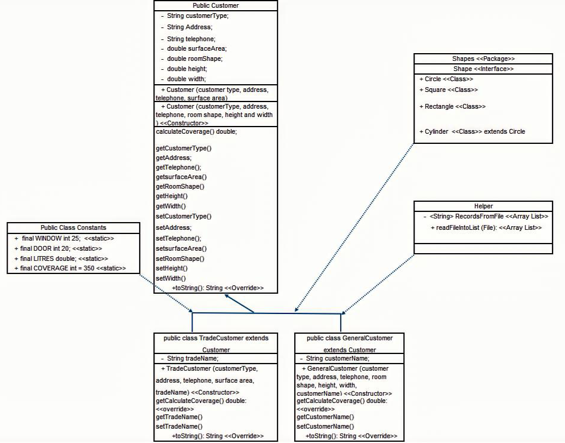

# DifferentCoat — Java OOP Paint Coverage System
A fully object oriented Java application designed to calculate paint requirements for different room shapes, supporting both general public and trade customers. This project demonstrates strong OOP design, UML driven development, file handling, inheritance, polymorphism, testing, and documentation — built using IntelliJ IDEA.

Project Overview
DifferentCoat staff needed a system to help customers calculate how much paint is required to paint a room — avoiding over buying or under buying. This Java OOP solution:
•	Reads customer records from a CSV file
•	Determines room shape and dimensions
•	Calculates surface area
•	Applies paint coverage rules
•	Outputs a formatted breakdown for each customer
•	Supports both General and Trade customers
•	Uses inheritance, polymorphism, abstraction, and encapsulation

Object Oriented Design
Base Class — Customer
Stores shared attributes:
•	Customer type
•	Address
•	Telephone
•	Surface area
•	Room shape
•	Height
•	Width
Includes:
•	Two constructors (surface area based & dimension based)
•	calculateCoverage() base method
•	Getters/setters
•	Overridable toString()
Derived Classes
GeneralCustomer
•	Adds: customerName
•	Overrides: calculateCoverage()
•	Overrides: toString()
•	Calculates area from height × width × shape
TradeCustomer
•	Adds: tradeName
•	Overrides: calculateCoverage()
•	Overrides: toString()
•	Uses pre provided surface area
Shapes Package
Implements polymorphic area calculations:
•	Shape (interface)
•	Square
•	Rectangle
•	Circle
•	Cylinder (extends Circle)
Each class implements:
•	getArea()
•	getPerimeter()

Constants Class
Stores reusable values:
•	Paint coverage per gallon
•	Litres conversion
•	Window/door area deductions
•	Shape identifiers
Helper Class
•	Reads DataFile.csv
•	Parses each record
•	Returns an ArrayList of customer objects

Demo Class
Runs the full system:
1.	Explains how the system works
2.	Loads customer data
3.	Instantiates correct customer types
4.	Outputs formatted paint calculations

Testing
TestNg tests included:
•	Customer object creation
•	Coverage calculations
•	Constants validation
•	File import tests
•	Shape area calculations
Test plan and logs are stored in:  report/DifferentCoat Test Plan.xlsm

Documentation
All coursework documentation is included in the docs/ folder:
•	Design specification
•	Implementation write up
•	Portfolio submission
•	User documentation
•	Assignment briefs
This provides full traceability from design → implementation → testing.

How to Run the Program
1.	Open the project in IntelliJ IDEA
2.	Ensure the folder structure matches src/main/java/com/nwrc/...
3.	Place DataFile.csv in the data/ folder
4.	Run: com.nwrc.Main.Demo
5.	View the console output for:
Customer details
Room shape
Calculated paint required
Coverage breakdown

Key Features
•	Full OOP architecture
•	Inheritance & polymorphism
•	File handling
•	Shape based area calculations
•	Customer type specific logic
•	Unit testing
•	Professional documentation
•	Real world problem modelling

# Class Diagram
The DifferentCoat system is built using a modular, object oriented architecture. Below is a structured UML-style breakdown of the classes, interfaces, inheritance, and relationships used in the project.
Customer Hierarchy
Customer (Base Class)
Fields
•	customerType : String
•	address : String
•	telephone : String
•	surfaceArea : double
•	roomShape : double
•	height : double
•	width : double
Constructors
•	Customer(customerType, address, telephone, surfaceArea)
•	Customer(customerType, address, telephone, roomShape, height, width)
Methods
•	calculateCoverage() : double
•	Getters & setters for all fields
•	toString() : String (overridable)

GeneralCustomer (extends Customer)
Additional Field
•	customerName : String
Constructor
•	GeneralCustomer(customerType, address, telephone, roomShape, height, width, customerName)
Overrides
•	calculateCoverage() : double
•	toString() : String

TradeCustomer (extends Customer)
Additional Field
•	tradeName : String
Constructor
•	TradeCustomer(customerType, address, telephone, surfaceArea, tradeName)
Overrides
•	calculateCoverage() : double
•	toString() : String

Shapes Package
Shape (Interface)
•	getArea() : double
•	getPerimeter() : double
Square
•	side : double
•	Constructor: Square(double side)
•	Implements: getArea(), getPerimeter(), toString()

Rectangle
•	length : double
•	width : double
•	Constructor: Rectangle(double length, double width)
•	Implements: getArea(), getPerimeter(), toString()
Circle
•	radius : double
•	Constructor: Circle(double radius)
•	Implements: getArea(), getPerimeter(), toString()
Cylinder (extends Circle)
•	height : double
•	Constructor: Cylinder(double radius, double height)
•	Additional method: getVolume() : double
•	Getters/setters for height
•	Overrides: toString()

Utilities Package
Constants
Stores fixed values used in calculations:
•	WINDOW : int = 25
•	DOOR : int = 20
•	COVERAGE : int = 350 (sq ft per gallon)
•	LITRES : double = 4.54 (litres per gallon)
All fields are static final.
Helper
Handles file input and record parsing.
Fields
•	recordsFromFile : ArrayList<String>
Methods
•	readFileIntoList(File file) : ArrayList<String>
Main Package
Demo
•	Explains system behaviour
•	Loads CSV data
•	Instantiates correct customer objects
•	Outputs formatted paint calculations

DifferentCoat/
│
├── src/
│   ├── main/java/com/nwrc/
│   │   ├── Customers/
│   │   ├── Shapes/
│   │   ├── Utilities/
│   │   ├── DataAccess/
│   │   └── Main/
│   │
│   └── test/java/com/nwrc/
│       └── AllTests/
│
├── data/
├── docs/
└── report/

## 🧩 Class Diagram (Visual)

The following diagram illustrates the full object-oriented structure of the DifferentCoat system, including class relationships, inheritance, attributes, and key methods.

